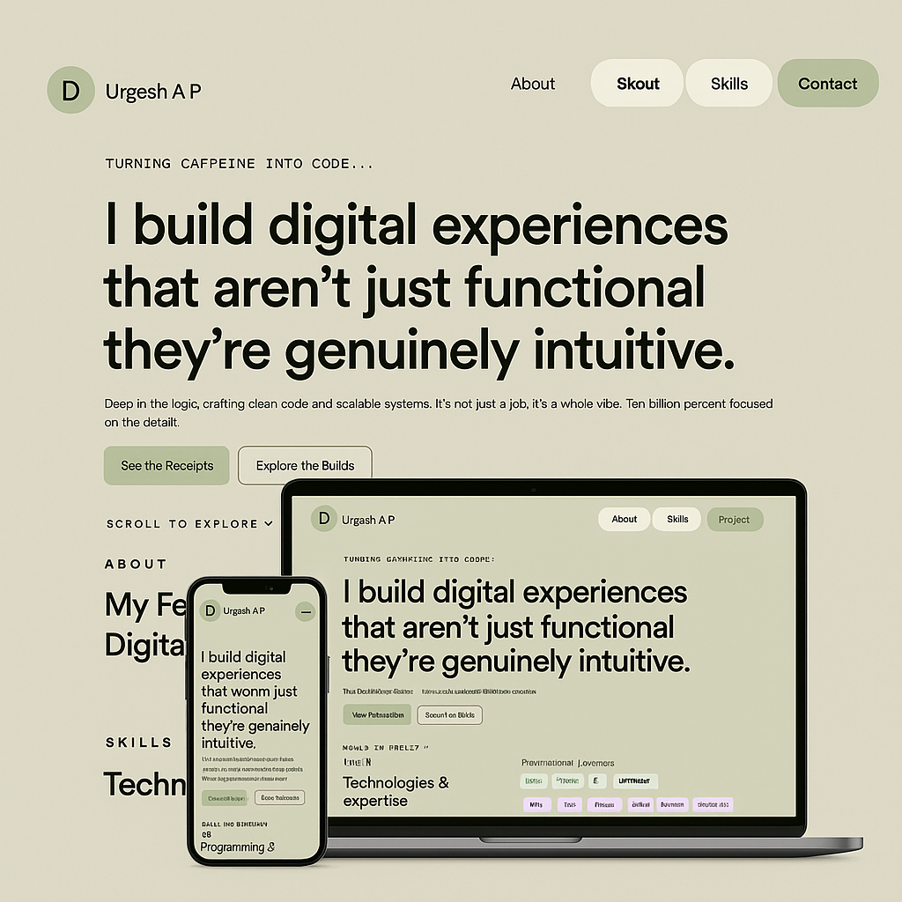

<div align="center">

# Portfolio Website

### [Durgesh3805](https://portfolio-five-dun-72.vercel.app)



<br>
My design portfolio to showcase a few projects that highlights my work, technical expertise, and creative journey through an elegant, user-friendly interface.

## 🚀 Live Demo

[View Portfolio](https://portfolio-five-dun-72.vercel.app)

</div>

### Built With

This project was built using these technologies.

- Next.js (React Framework)
- CSS
- JavaScript (ES6)
- PostCSS

## ✨ Features

🖥️ **Single Page Layout**  
Smooth and minimal design — all content displayed on a single elegant page.

🎨 **Styled with Vanilla CSS**  
Built entirely with **custom CSS**, making it lightweight, fast, and easy to modify colors, fonts, and layouts.

📱 **Fully Responsive**  
Designed to look great on any device — desktop, tablet, or mobile.

## ⚙️ Getting Started

Follow these steps to set up and run the project locally on your machine.

### 🧩 Prerequisites

Make sure you have one of the following installed:

- [**Node.js**](https://nodejs.org/) (v18 or above)
- or [**Bun**](https://bun.sh/) (optional, faster alternative)

---

## 📥 Installation

### 1. Clone the Repository

```bash
git clone https://github.com/your-username/your-repo-name.git
```

### 2. Then navigate into the project folder:

```
cd your-repo-name
```

### 3 Install Dependencies

If you’re using npm:

```
npm install
```

Or if you’re using Bun:

```
bun install
```

### 3. Run the Development Server

Using npm:

```
npm run dev
```

Or using Bun:

```
bun run dev
```

The app will start running locally.

By default, it’s available at:

```
👉 http://localhost:3000
```

### 4. Open in Browser

Once the server starts, open your browser and visit:

```
http://localhost:3000
```

You should now see the Portfolio project running locally 🚀

## 💬 Contact me

<div align="center ">

[](https://www.linkedin.com/in/durgeshap)
[](https://github.com/Durgesh3805)

</div>
